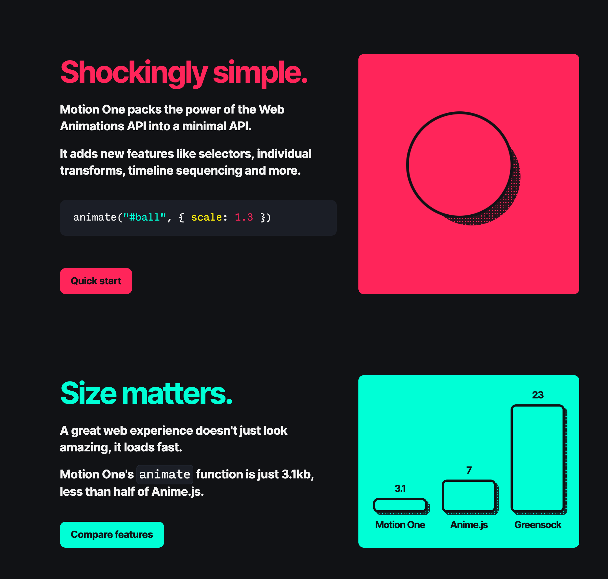

Hello everyone this is Ray Villalobos and I stream about front-end and full stack tools Wednesdays at 1pm Eastern time 10am Pacific. So follow me and subscribe on all the social media things for tons more content. If you want to watch any past episodes, make sure you take a look at my blog...raybo.org.

I’ve been gone for a few weeks trying to catch up with some work projects, so hopefully I’ll be back for at least a few weeks. In the meantime though, lets get started with some shorts.

# Toolbox Shorts

Let's get started with some shorts. There are new tools and articles that you should know about.

---

## Motion One

Close to a tenth the size of Greensock (which I love), this animation framework focuses on performance by using hardware acceleration. Pretty promising

---

## Flexbox Patterns

All the cool kids love to tell you how great CSS Grid is, but Flexbox still has a lot of Mojo and is better for some things. This cool site has a number of prebuilt patterns for different layouts using Flexbox...Take that...CSS Gridsters."

---

## AtroposJS

You totally didn’t know you wanted to use this library until you visit the site and play around with it. A framework compatible library for building touch enabled 3d parallax transformations. Sounds like it should be in some sort of Web Developer bingo pool.

---

# Pollen

I’m always happy when I’m learning new things, so I keep finding interesting libraries and frameworks that I want to try and there’s nothing like giving yourself a goal like a live stream to make yourself learn something on a schedule.

I’m experimenting with pre-recording some of these segments, so you don’t see me stumbling around typing everything, but I promise that I’ll stop and see if you have questions.

## What is Pollen?

[Pollen](https://www.pollen.style/) is a variable based CSS library that was inspired by one of my other favorites…Tailwind CSS. It’s a lot simpler…as a matter of fact, it’s really just a bunch of CSS variables that have been pre-built.

Right now it doesn’t really have a ton of functionality, but I do think it has some value, specially if you’re trying to stay away from something like Tailwinds, which fills your HTML with a ton of classes.

  <iframe  src="https://www.youtube.com/embed/Cl2uFIUXqeQ?start=64" title="YouTube video player" frameborder="0" allow="accelerometer; autoplay; clipboard-write; encrypted-media; gyroscope; picture-in-picture" allowfullscreen></iframe>

And that’s pretty much how you use pollen. You use the variables that are available in the library.

Before I get into the full demo, I am going to show you how I set up this project with [Alpine.js](https://alpinejs.dev/). I did a demo of Alpine.js in [episode 7](https://youtu.be/OGymLdZ3svc), so you can check that out. The cool thing about Alpine is that there are only 23 things in the entire framework…15 attributes, 6 properties and 2 methods. Let’s take a look:

  <iframe src="https://www.youtube.com/embed/Cl2uFIUXqeQ?start=139" title="YouTube video player" frameborder="0" allow="accelerometer; autoplay; clipboard-write; encrypted-media; gyroscope; picture-in-picture" allowfullscreen></iframe>

I think Alpine would be perfect for a simple single page website. Maybe not for a large application, but it’s pretty powerful and I’m just scratching the surface, there are cool ways to manage events and animate content. It’s a lot like React and Vue, you just have to get used to doing all of your JavaScript in HTML.

Alright, let’s get back to Pollen. In PollenCSS, the variables are categorized into different groups, so you have typography variables with a font size scale, different weights, leading and tracking.

You also get some layout variables, with a size scale for smaller items and a width scale that are sort of like what you get on a Bootstrap or Tailwind Grid.

There’s also a handful of colors and there are four shades of each of the colors so you can get darker versions of each. It’s not a ton of colors, but it’s got most of the ones you’d use. If you don’t like the colors, you can easily override not just the colors, but any variable.

Finally, there’s a section called UI that has something you can use for shadows, easing, radius and creating layers.

And that’s all there is to it. This library is extremely minimal. In reality it is literally just a bunch of pre-built variables. Let’s see how you might use it to build a simple layout.

  <iframe src="https://www.youtube.com/embed/Cl2uFIUXqeQ?start=561" title="YouTube video player" frameborder="0" allow="accelerometer; autoplay; clipboard-write; encrypted-media; gyroscope; picture-in-picture" allowfullscreen></iframe>

So that’s Pollen for you. What do you think. I am like 55% sold on the library. I think that I’d go for it if I wanted to stick with straight CSS on a small project. Some people really hate how bloated something like Bootstrap or Tailwinds feels.

Also, there is VERY little setup and no tooling. This is just CSS, so as long as you are targeting browsers that support variables, you’re good to go here.

What do you think? Let me know in the comments? Also, if there’s some cool new framework you want me to try.

If you want to play around with the finished code for this, I added the [finished code](https://go.raybo.org/5_fJ) to my Github Repo. If you want to play along while you watch this recording later, you can get the [starting version](https://go.raybo.org/5_fH). Make sure you have the [CodeSwing extension](https://go.raybo.org/5_xC).

### URLs

**Pollen**: https://pollen.style
**Starting Repo**: https://go.raybo.org/5_fH
**CodeSwing**: https://go.raybo.org/5_xC
**AlpineJS**: https://alpinejs.dev
**Finished Code**: go.raybo.org/5_fJ

---

# PostFix

## Episode 09

I’ve already scheduled a new Toolbox episode for [next week](https://www.linkedin.com/video/event/urn:li:ugcPost:6852737335998627840/). I’m going to be focusing on [Vite](https://vitejs.dev/), which is a set of build tools that was created by the developers of Vue.js. It’s pretty easy to get going with it, so hopefully you’ll make it back next week. If you’re on LinkedIn, you can [get a reminder](https://go.raybo.org/5_gK).

## Newsletter

I’m also back writing articles for the [newsletter](<[https://go.raybo.org/5Tbq](https://go.raybo.org/5Tbq)>). Last week, I did a n article on an infamous Panamanian fighter, Roberto Duran, but I usually post these about every week

## Site

And of course, for all the latest on what I’m up to, visit my blog, [raybo.org](http://raybo.org), where you can find all of my latest work including courses, videos and the shorts. So if you remember you saw a cool tool, there’s a search at the top of the site where you can quickly get to one of the older shorts, or just click on the [shorts link](<[https://raybo.org/shorts/0/](https://raybo.org/shorts/0/)>).
