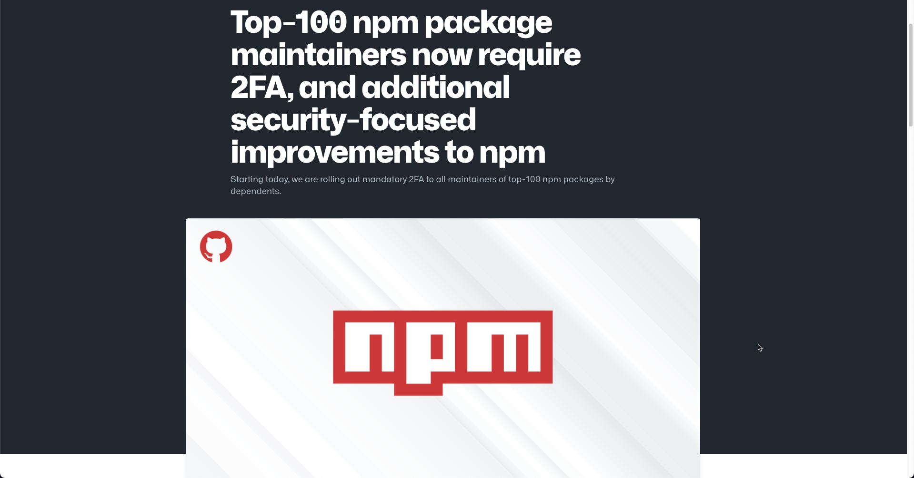
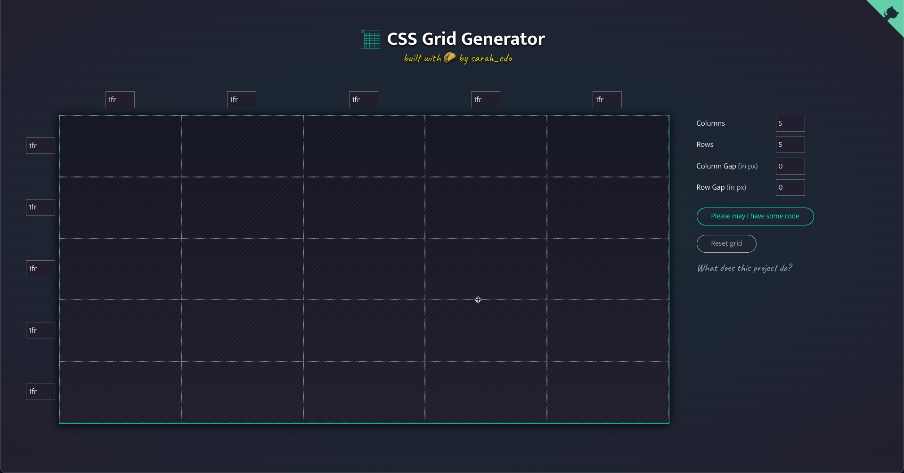

Hello everyone this is Ray Villalobos and I stream about front-end and full stack tools Wednesdays at 1pm Eastern • 10am Pacific. Follow me and subscribe on all the social media things for more content. If you want to watch any past episodes, make sure you take a look at my blog...raybo.org.

One of the things that's really surprised me recently is how a lot of new frameworks are revisiting the backend and that's what we're going to explore later on.

# Shorts

### Sponsors Only Repositories

GitHub has now added the ability to create [sponsors only repositories](). This is sort of competing with Patreon, but really just making sponsorships a lot easier.

That means you can create a repo that is only visible to people who support you on GitHub.

The whole world of support for maintainers is broken. Lots of people who are doing excellent work aren't supported

Recently they added discussions and now that makes a lot more sense because you can create discussions to engage and interact with your sponsors.

### Fetch in Node Core

The Fetch API is a modern promise based API that thankfully replaced AJAX and is the de-facto standard for front end developers.

Node.js 17.5 features [built in support for Fetch](https://fusebit.io/blog/node-fetch). This is pretty big news because it makes things easier on the server side. A single API that is able to read content using the same API just makes it easier to do things.

Before this, you had to use an external module called node-fetch. So that's going away. It's still a bit early for this, but I can't wait.

### Top 100 package maintainers require 2FA

This is pretty big news. npm is requiring the top 100 npm package [maintainers to use 2FA](https://github.blog/2022-02-01-top-100-npm-package-maintainers-require-2fa-additional-security), or two factor authentication.

There's a bit of setup and when you log into your account, you sometimes have to sync via an alternative login method.

You can now also turn that on within an organization.

### CSS Grid Generator

I was working on the demo and realized that [Pico.css](https://picocss.com/) doesn't have a good grid system. The options are to add the Bootstrap Grid or use CSS grid to lay things out.

I find the fractional width language a bit confusing, so this is a really nice visual tool that can help you create a grid rather quickly.

### Bootstrap Icons

This icon library keeps getting better and better. It's now my go to library for high quality icons. Although I also like the interface behind [css.gg](https://css.gg/), Bootstrap Icons are already up to twice the size at 1600 icons and constantly being updated.

They just released 140 new icons, which are mostly valentines, file extensions and a lot of other utility icons. It's not the icons per se that I love, but the fact that the library is continuously being updated with quality content.

### Shadow Web Lite YouTube Component

This is an extremely fast way to display videos on your site. It's a clone from Paul Irish's excellent [lite youtube embed](https://github.com/paulirish/lite-youtube-embed), but what makes it different is that it uses web components.

If you haven't used this, it will get rid of a bunch of tracking code and who knows what else that slows down the display of YouTube videos on websites. Who knows what YouTube is doing, but this is...according to Paul Irish 224 times faster. I use this on raybo.org.

### The Story of React

This is a documentary type video which discusses the history of the React Framework. If you don't know why React has pretty much won the framework war...at least for the type being...then this is a great video that goes through it's entire background, discussing other frameworks and why they fail where React has succeeded.

There's a few new frameworks that are trying to challenge React's superiority, but they have a big hill to climb.

### Remix

In this tutorial I'm going to build a simple app in less than 10 minutes to give you an idea of what Remix is trying to do and how it beautifully manages one of the hardest parts of the web...routing.

I'll show you how to install Remix, what you get once that's done, how to add some modules like Pico, add CSS files, regular and nested routes.

## Links

- [Hydrogen](https://hydrogen.shopify.dev/)
- [NextJS](https://nextjs.org/)
- [Nuxt](https://v3.nuxtjs.org/)
- [Pico CSS](https://picocss.com/)
- [Remix](https://remix.run/)
